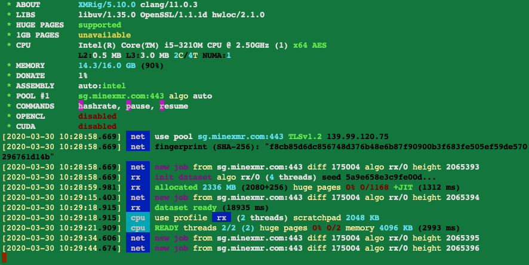

# xmrig macOS build

RandomX, CryptoNight, AstroBWT and Argon2 CPU/GPU miner - __macOS Build Only__

## Download
* [xmrig macOS build releases](https://github.com/mydicebot/xmrig-macos-build/releases)

## Usage
The preferred way to configure the miner is the [JSON config file](src/config.json) as it is more flexible and human friendly. The command line interface does not cover all features, such as mining profiles for different algorithms. Important options can be changed during runtime without miner restart by editing the config file or executing API calls.

* **[xmrig.com/wizard](https://xmrig.com/wizard)** helps you create initial configuration for the miner.
* **[workers.xmrig.info](http://workers.xmrig.info)** helps manage your miners via HTTP API.

---

# [Free Dogecoin Cloud Mining + 2% Daily Profit!](https://www.doge.live/?d=100489)

